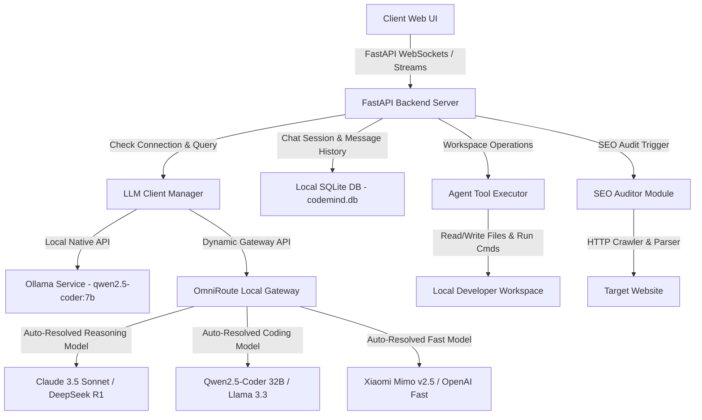
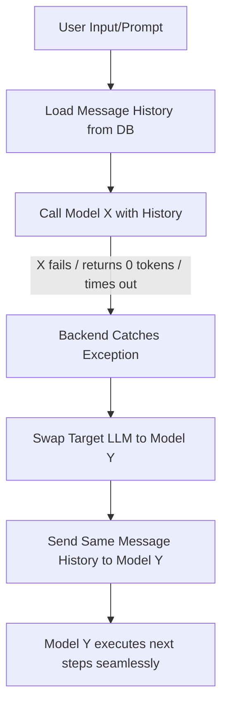

# 🧠 CodeMind

> **The Ultimate Premium Coding AI Chatbot & Autonomous Software Engineering Agent**
> 
> *Architected and developed under the vision of **Subhamoy Bhattacharjee (Chief Engineer, SB Tech)**.*

---

## 🌟 Overview & Purpose

**CodeMind** is an industry-grade, full-stack, autonomous software engineering platform. Far beyond a simple conversational interface, CodeMind orchestrates a cyclic agentic loop capable of researching codebases, surgically patching workspace files, executing terminal commands, performing live web searches, and delivering comprehensive, multi-threaded SEO audits—all within strictly sandboxed boundaries.

### 🔒 100% Local & Private Option
CodeMind is engineered to prioritize developer privacy and data security. By choosing the **`qwen2.5-coder:7b`** configuration, CodeMind executes queries **entirely locally on your own machine** through your local **Ollama** service.
- **Zero Cloud Leakage**: Your code, workspace configurations, and conversation prompts never leave your local system.
- **Full Offline Capability**: Run advanced coding sessions, agentic workspace edits, and terminal command executions without any active internet connection.
- **Maximum Speed**: Leverages your local CPU/GPU hardware directly to eliminate network round-trip latencies.

CodeMind bridges the gap between local speed and global intelligence by utilizing a hybrid database model. It maintains session states and histories locally in a high-performance **SQLite database** while utilizing a secure cloud-level authentication system. It represents the pinnacle of modern AI-assisted software engineering.

---

## 📋 Prerequisites & Required Setup

To run and use **CodeMind**, you must satisfy the following two requirements:

### 1. Local LLM Setup (Ollama & Qwen2.5-Coder:7b)
CodeMind uses a local model for offline tasks, intent classification, and fallback operations.
*   **Ollama**: Install the Ollama framework on your system. You can download it from [Ollama's Official Website](https://ollama.com/). *(Note: CodeMind's startup script `setup_ollama.py` will attempt to automatically download and install Ollama silently on Windows if it is not found).*
*   **qwen2.5-coder:7b**: You must pull the `qwen2.5-coder:7b` model to your local Ollama library by running:
    ```bash
    ollama pull qwen2.5-coder:7b
    ```

### 2. OmniRoute Custom Credentials
For advanced gateway routing (such as using the **"Let CodeMind decide"** or **"OmniRoute"** options), CodeMind requires connection credentials to the **OmniRoute Local Gateway**.
*   **What are they?** An **Endpoint Base URL** (typically pointing to your OmniRoute API gateway) and a secure **API Key**.
*   **How to obtain them?** The user must collect these credentials themselves directly from the **OmniRoute platform**. If you need support or guidance during the process, SB Tech can assist:
    1. Register or log in to the **OmniRoute platform** to retrieve your unique API Key and Endpoint Base URL.
    2. If you need help with credentials setup, hosting, or troubleshooting, visit [SB Tech](https://www.sbtech.co.in/) or contact **Subhamoy Bhattacharjee** (Chief Engineer, SB Tech) for support.
*   **Configuration**: Once obtained, click on the **"LLM Settings"** button in the CodeMind sidebar, select either **"Let CodeMind decide"** or **"OmniRoute"**, click **"Edit Credentials..."**, and input your custom Endpoint and API Key.
*   **Auto-Detection & Autostart**: If you select Option 1 or 2 and the local OmniRoute gateway service is not running, CodeMind automatically detects this during connection tests or chat queries. It launches the service silently in the background and notifies you in real-time.

---

## ⚡ Architectural Diagram & Workflow



### The Autonomous Agentic Loop

When **Agentic Mode** is toggled ON, CodeMind executes an advanced, self-correcting cognitive loop:

1. **Deconstruct**: CodeMind ingests your prompt along with the loaded codebase context (folders and files mounted directly into the active session scope).
2. **Reason**: If **Deep Thinking** is active, CodeMind uses gateway reasoning models to output step-by-step thinking processes wrapped inside `<think>` blocks. These reasoning tokens are streamed in real-time directly to the UI.
3. **Plan & Lock (Planning Mode)**: If CodeMind classifies your request as a new project build (e.g., *"build a calculator webapp"*), it enters a strict **Planning Mode Lock**. It writes a detailed `implementation_plan.md` to your workspace and refuses to execute commands or write actual code files until you reply with `approve` or `build`.
4. **Execute**: Once unlocked, CodeMind streams semantic tool calls (e.g., `<tool_call name="write_file">`). The FastAPI backend intercepts these calls, performs directory boundary checks, executes them, and returns the stdout/file output to the LLM inside `<tool_response>` tags.
5. **Verify & Self-Heal**: The agent runs testing commands inside your workspace terminal, catches errors, and recursively patches its own code until compilation passes and all unit tests succeed.

---

## 🛠️ Advanced Engineering & Core Modules

### 1. Unified LLM Client (`llm_client.py`)
A highly optimized API wrapper that handles native streaming completions for Ollama and OpenAI-compatible API gateways:
- **Dynamic Model Resolution**: Automatically resolves the best model for the task context when set to `codemind-decide`:
  - `purpose="classification"` → `auto/best-fast` (extremely fast, low-cost)
  - `purpose="reasoning"` → `auto/best-reasoning` (thinking models like DeepSeek R1)
  - `purpose="coding"` (Default chat) → `auto/best-coding` (optimized for code generation)
- **Live Reasoning Token Streaming**: Parses reasoning tokens from gateway models (`delta.reasoning`) and streams them to the UI in real-time, allowing developers to follow the agent's thoughts as they form.
- **Self-Healing Fallback Loop**: If the resolved gateway model fails or yields `0` tokens (e.g. VRAM capacity issues on local gateways), CodeMind automatically logs the error and retries the prompt against fallback models (`auto/best-fast` → `qwen2.5-coder:7b` → `llama3.2:1b`) inline, ensuring zero-downtime streaming.
- **Robust Connect Timeout**: Enforces a strict 10-second connect timeout on external requests to prevent indefinite server hangs.

### 2. State-Preserving Authentication (`main.py`)
- **Conversation State Manager**: Tracks the exact state of project builds. Once a build request is identified, the system locks the build request index so subsequent developer inputs (like `approve` or `build`) do not reset the state, maintaining authentication status across the build lifecycle.
- **Protected Sandboxing**: Enforces path verification on all file reads/writes, preventing directory traversal attacks (`../`) outside the active workspace directory.

### 3. Deep SEO Audit Engine (`seo_audit.py`)
A multi-threaded audit tool that parses target web domains:
- **Heading & Alt Hierarchy**: Evaluates Alt tags, H1-H6 heading hierarchy, and external vs. internal link distributions.
- **Asset Metadata Analysis**: Estimates page weights and size footprints by making concurrent async `HEAD` requests to static assets (images, stylesheets, scripts).
- **SEO Report Generator**: Pipes raw crawl data through the active LLM to generate professional, prioritized recommendations in Markdown format.

### 4. Interactive Configuration UI (`static/index.html` & `app.js`)
An obsidian-dark theme designed with vanilla CSS, glassmorphism elements, and micro-animations:
- **Simplified LLM Selection**: Only three options are presented to the user:
  1. **Let CodeMind decide** (Dynamically maps tasks to the best gateway model)
  2. **OmniRoute** (Queries your local routing gateway directly)
  3. **qwen2.5-coder:7b** (Direct local Ollama connection)
- **Modal Popup Credentials Trigger**: Selecting option 1 or 2 reveals an **`Edit Credentials...`** button, allowing developers to update their Endpoint Base URL and API Key at any time through a smooth overlay popup. Option 3 connects seamlessly in the background without popups.
- **Cache-Busting Assets**: Script and style tag references in the HTML are versioned dynamically (e.g. `?v=2.2.3`) to force browsers to reload modified scripts immediately instead of using stale disk caches.

### 5. Startup Dependency Verification Engine (`setup_ollama.py` & `main.py`)
CodeMind performs a comprehensive diagnostic scan of your environment at startup to verify all local dependencies:
- **Terminal Console Logs**: During server startup, the CLI verifies the installation status and version numbers of **Node.js**, **NPM**, **OmniRoute**, and **Ollama**, displaying a consolidated setup report.
- **System Check REST API**: Exposes a dedicated `/api/dependencies` GET endpoint which serves the parsed environment statuses and version strings to the client interface.
- **Welcome Screen Widget**: Automatically queries the API on page load and renders a **System Dependency Check** panel on the browser dashboard, alerting you if dependencies needed for local routing (like Node or OmniRoute) are missing.

---

## 🔄 OmniRoute Model Selection & Fallback Mechanics

When utilizing **OmniRoute** via the **Let CodeMind decide** (`codemind-decide`) option, the system handles routing decisions and errors through a custom intelligent dispatch loop:

### 1. How CodeMind Chooses Models Dynamically
Upon receiving a prompt, CodeMind makes an asynchronous HTTP GET request to the OmniRoute gateway's `/models` endpoint to query all active and available models on your gateway. It then runs its selection hierarchy depending on the task's **purpose**:

*   **Classification (`purpose="classification"`)**: Used to determine the user's intent. Matches available models against:
    `["auto/best-fast", "pollinations/openai-fast", "pol/openai-fast", "pollinations/openai", "pol/openai", "llama3.2:1b", "qwen2.5:1.5b", "llama3.2", "gpt-4o-mini"]`
*   **Reasoning (`purpose="reasoning"`)**: Used when Deep Thinking mode is enabled. Matches available models against:
    `["auto/best-reasoning", "deepseek-reasoner", "deepseek-r1", "o1", "o3", "thinking", "reasoner"]`
*   **Coding & Chat (`purpose="coding"`)**: Default coding and chatting model. Matches available models against:
    `["auto/best-coding", "auto/best-fast", "pollinations/openai", "pol/openai", "pollinations/openai-fast", "pol/openai-fast", "omniroute", "coder", "code", "codemind"]`

*If no matches are found, it falls back to using the very first model returned by your gateway, or defaults to `pollinations/openai`.*

### 2. What Happens When a Model Reaches Limits or Fails?
CodeMind implements a self-healing fallback queue to ensure your development workflow is never interrupted:

1.  **Queue Assembly**: CodeMind builds a fallback chain of models to try in order of speed and stability:
    `[resolved_model, "auto/best-fast", "qwen2.5-coder:7b", "llama3.2:1b"]`
2.  **Rate Limit / HTTP Error Recovery**: If a model returns an HTTP status code other than `200` (such as `429 Too Many Requests`, `503 Service Unavailable`, or `504 Gateway Timeout`), CodeMind logs a warning and immediately falls back to the next model in the queue.
3.  **VRAM Context Limit / Empty Completion Recovery**: If the gateway returns `200 OK` but generates `0` tokens (which happens when local gateway models run out of VRAM context space), the system identifies the empty stream, logs the token warning, and transitions to the next model.
4.  **Graceful Termination**: CodeMind only surfaces a connection error to the UI if all models in the fallback chain fail, providing the developer with maximum resilience.

### 2.1 How Continuity and Memory are Maintained During Fallbacks
When the current model (Model X) fails or reaches a rate limit and a fallback model (Model Y) takes over, CodeMind ensures a seamless transition without losing progress:

*   **Shared SQLite Database History**: Every prompt, assistant reply, tool call (e.g., writing files), and tool output (e.g., compiler stdout) is logged chronologically to the local database (`codemind.db`).
*   **Transparent Context Swap**: The backend handles the fallback swap transparently. The new model (Model Y) receives the exact same conversation history (`llm_history`) that was active. Model Y reads this, understands what Model X did and what errors occurred, and picks up the task from that exact point.
*   **Context Window Pruning (`prune_old_tool_responses`)**: If the conversation gets too long, CodeMind summarizes or prunes older, verbose tool outputs (like long console logs) to fit the new model's token limit, while preserving high-level instructions, recent chat logs, and workspace layout state.
*   **Workspace State Verification**: Since CodeMind operates on your physical workspace, fallback models can list directories or read files to inspect the actual build files on disk and align themselves.



### 3. What Happens When Option 2 (OmniRoute) is Chosen?
When you select the **`OmniRoute`** option from the dropdown menu, the system operates in a deterministic gateway-level routing mode:
*   **Custom Endpoint Routing**: CodeMind directs the query to the custom Endpoint Base URL and uses the custom API Key that you entered in the overlay popup modal.
*   **Exact Model Target**: Requests the specific model name `"omniroute"` from your gateway.
*   **Gateway-Level Routing**: Relies entirely on the OmniRoute gateway's own default internal mapping to route the request to its default backing LLM.
*   **No Client-Side Fallbacks**: Bypasses the CodeMind client-side fallback list. Any limits, timeouts, or route failures are managed directly at the gateway level rather than retried on the client.

### 4. What Happens When Option 3 (qwen2.5-coder:7b) is Chosen?
When you explicitly select the **`qwen2.5-coder:7b`** option from the dropdown menu, the system operates in a deterministic, direct-request mode:
*   **Direct Routing**: Rather than routing through the OmniRoute gateway proxy, CodeMind communicates directly with your local Ollama service (`http://localhost:11434`).
*   **Bypasses Resolver**: All dynamic resolution classification and reasoning preference checks are bypassed. The query is sent as-is straight to the local Ollama server.
*   **No Fallbacks**: Because this is an explicit model selection, the self-healing fallback queue is disabled. If the local Ollama service fails to host or run the model, the connection error is immediately returned to you without trying other models.
*   **100% Local Execution**: The request is processed entirely locally on your CPU/GPU, ensuring complete offline capability, maximum privacy, and zero reliance on cloud APIs.
*   **No API Key Needed**: Since the model runs directly through local Ollama, no API key or token authentication is required for client-to-Ollama requests.

### 5. Automatic Service Recovery & Autostart
If CodeMind detects that the local OmniRoute gateway service is not running when Option 1 or 2 is active, it runs an auto-recovery process:
*   **Detection**: During connection verification or when a chat query is launched, the backend pings the gateway. If it receives a connection failure, it flags the gateway as down.
*   **Autostart**: CodeMind launches the local `omniroute` process in background mode (`omniroute --no-open`) silently, running it as a background service without opening console window prompts on Windows.
*   **Real-Time Notification**:
    *   **Settings Modal**: Displays a status confirmation message directly in the settings UI.
    *   **Chat Streams**: Streams system notice messages directly into the UI (e.g. `⚠️ [System Notice: Local OmniRoute service is not running. CodeMind is starting it automatically...]` followed by `⚡ [OmniRoute service started successfully. Re-establishing connection...]`) before starting the LLM stream.

### 📊 Tabular Comparison: Option 1 vs. Option 2 vs. Option 3

| Feature / Aspect | Option 1: Let CodeMind decide | Option 2: OmniRoute | Option 3: qwen2.5-coder:7b |
| :--- | :--- | :--- | :--- |
| **Model Value Sent** | `"codemind-decide"` | `"omniroute"` | `"qwen2.5-coder:7b"` |
| **Endpoint Base URL** | Custom (from Credentials Popup) | Custom (from Credentials Popup) | Fixed (`http://localhost:11434`) |
| **API Authentication Key** | Custom (from Credentials Popup) | Custom (from Credentials Popup) | None (Not required) |
| **Selection Logic** | **Dynamic Resolver**: CodeMind queries `/models` on your gateway to fetch all active model IDs, then selects the best model matching your task's purpose (e.g. `auto/best-reasoning` for deep thinking, `auto/best-coding` for coding). | **Gateway Default**: Requests the gateway's default model configuration name (`"omniroute"`). | **Deterministic Local**: Requests the exact model name `"qwen2.5-coder:7b"`. |
| **Local / Offline Option** | Hybrid (depends on your custom gateway models) | Hybrid (depends on your custom gateway configuration) | **100% Local**: Runs entirely offline on your local Ollama setup. |
| **Client-Side Fallback Queue** | **Enabled**: If the selected model fails or yields 0 tokens, CodeMind retries automatically through `["auto/best-fast", "qwen2.5-coder:7b", "llama3.2:1b"]`. | **Disabled**: No client-side fallbacks. Relies on gateway-level routing and limits. | **Disabled**: No client-side fallbacks. Bypasses dynamic resolver to run only the selected local model. |

---

## 🚀 Installation & Quick Start

### Prerequisites
- Python 3.8+
- **Ollama** and the **qwen2.5-coder:7b** model (See [📋 Prerequisites & Required Setup](#-prerequisites--required-setup) for setup instructions)
- **OmniRoute Custom Credentials** (See [📋 Prerequisites & Required Setup](#-prerequisites--required-setup) for retrieval instructions)

### 1. Clone & Set Up Directory
```bash
git clone https://github.com/sbtech/codemind.git
cd codemind
```

### 2. Install Dependencies
```bash
pip install -r requirements.txt
```

### 3. Launch CodeMind

You can run CodeMind in two ways:

#### Option A: Quick-start (Recommended on Windows)
Simply double-click **`run.bat`** (or run it from the console).
*   It automatically detects if a virtual environment (`.venv` or `venv`) is present and activates it.
*   It spawns `launcher.py` which boots `main.py` and waits for it to become online.
*   Once the server is ready, it automatically opens `http://127.0.0.1:8000/` in your default browser.
*   Closing or stopping (`Ctrl+C`) the console window will gracefully shut down all background server processes.

#### Option B: Manual Startup
Run:
```bash
python main.py
```
Upon launching, CodeMind runs its startup diagnostic wrapper (`setup_ollama.py`):
1. Verifies if Ollama is installed on your host system (downloads/installs silently if missing).
2. Verifies if the local Ollama background service is running.
3. Automatically pulls the `qwen2.5-coder:7b` model to ensure offline operation is ready.
4. Binds the FastAPI server to `http://127.0.0.1:8000/`.

---

## 🔒 Security Specifications
- **Secure File Boundaries**: All path operations must resolve within the scope of the developer's loaded folder path. Any operations attempting to touch paths outside this scope return `Access Denied`.
- **Credential Protection**: Custom Endpoint Base URLs and API Keys are persisted safely in the browser's `localStorage` and sent over secure endpoints to prevent credentials from being logged on the server.

---

## 🏆 Development & Quality Standards
CodeMind was built to demonstrate **world-class AI engineering**:
- **Separation of Concerns**: Backend endpoints, LLM clients, databases, and page auditing are separated into clean, modular files.
- **Fault-Tolerant Connections**: The DB initialization module features a socket-level DNS handshake fallback (`check_internet`) to handle offline states gracefully without throwing unhandled exceptions.
- **Asynchronous Flow Control**: Leverages `asyncio` and async generators to handle non-blocking, multi-user WebSockets and Server-Sent Event (SSE) streams simultaneously.
